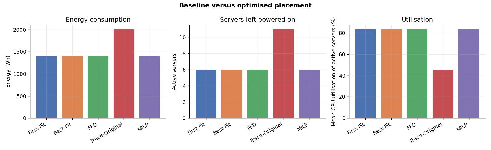
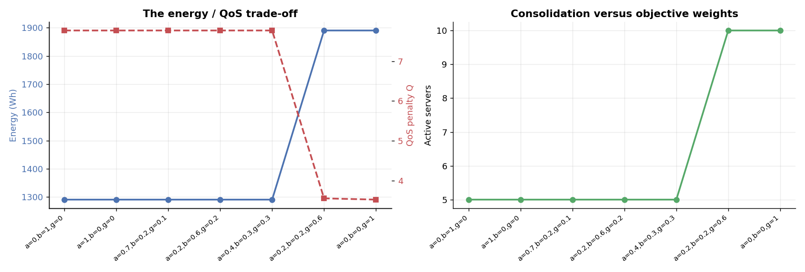
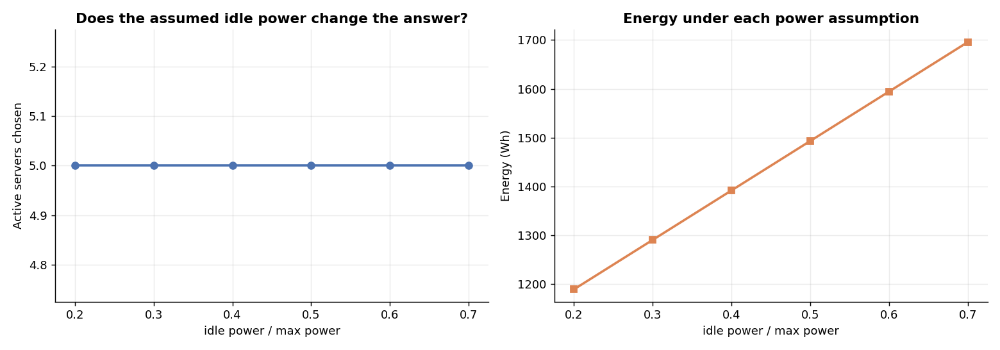
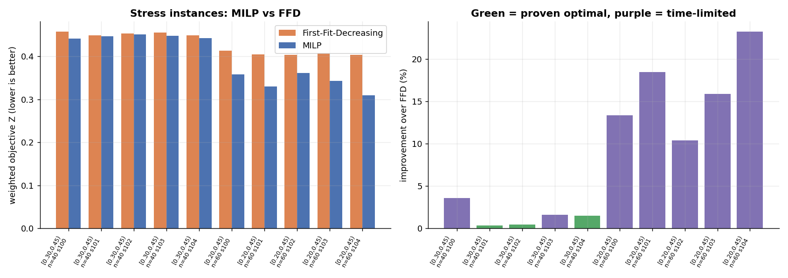
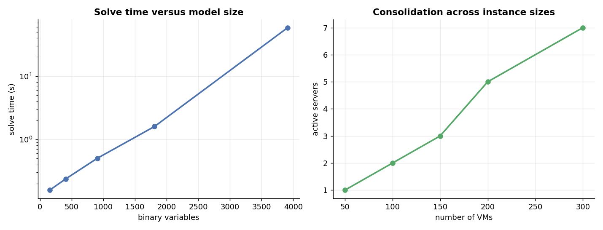

# Energy-Efficient Virtual Machine Placement in Cloud Data Centres Using Multi-Objective Integer Programming

Operations Research project, Amrita Vishwa Vidyapeetham, Semester 7.
Code, data pipeline, tests and dashboard: this repository. Full formulation:
[formulation.md](formulation.md). Full result tables: [RESULTS.md](RESULTS.md).
Literature: [literature_review.md](literature_review.md).

---

## Abstract

Cloud providers lose energy and capacity when workloads are placed badly, but
packing workloads tightly raises the risk of overload. We formulate virtual
machine (VM) placement as a multi-objective mixed-integer linear program that
minimises a normalised weighted sum of energy, resource wastage and a
QoS/reliability risk term, subject to CPU and memory capacity. The model is
instantiated on the Google Borg 2019 cluster trace (237,839 VM instances after
collapsing 405,894 event records) and solved with CBC. On a 250-VM reference
instance the MILP is proven optimal and improves the objective by 4.1 % over
First-Fit-Decreasing at the same server count and energy, entirely through
lower QoS risk. Raising the QoS weight from 0.3 to 0.6 makes the optimum switch
on every server (6 to 11), trading +42.5 % energy for a 61.5 % lower QoS
penalty. The recommended placement is unchanged when the assumed idle-power
ratio is varied from 20 % to 70 %. On deliberately hard packing instances the
MILP improves on First-Fit-Decreasing by 1.5 % to 16 % on average, though the
larger gains are not proven optimal. The exact method is proven optimal up to
about 6,000 binary variables. We state plainly what the study does not show:
there is no energy saving over a good heuristic on the representative
instance, the power model is assumed, and the QoS term is a proxy.

## 1. Introduction

A data centre's physical servers draw substantial power even when lightly
loaded, so running fewer, fuller servers saves energy. Consolidating too hard
leaves no headroom for load spikes and degrades service. VM placement is the
decision that mediates this trade-off: which VM runs on which server.

The decision is discrete, since a VM cannot be split across servers, and it is
constrained by finite CPU and memory. That makes it an integer program. Because
energy, resource efficiency and service quality pull in different directions, a
single-objective model would hide the trade-off that matters.

**Research question.** *How can multi-objective integer programming improve VM
placement by balancing energy consumption, resource utilisation and
QoS/reliability under real workload conditions?* Section 6 answers it.

## 2. Related work

Multi-objective integer programming for VM placement already exists
(Regaieg et al., 2021), as do ant-colony (Gao et al., 2013) and evolutionary
(Torre et al., 2020) approaches, energy-aware consolidation (Beloglazov and
Buyya, 2012), and communication-aware variants. This project does **not** claim
a new formulation. Its contribution is an applied, reproducible, dataset-driven
study: real Borg workload data, explicit handling of what the data does not
contain, a proof that the naive QoS definition cannot influence the result,
solver-honest reporting, and an interactive dashboard. See
[literature_review.md](literature_review.md).

## 3. Data

The Google Borg 2019 trace (Tirmazi et al., 2020) has 1,324,695 lines, which
are 405,894 records because some fields contain embedded newlines. Records are
**events**, not VMs: an instance emits several rows (`ENABLE`, `SCHEDULE`,
`FINISH`, `FAIL`, ...). A VM instance is identified by
`(collection_id, instance_index, cluster)`, and collapsing the event stream
gives **237,839 VM instances** after removing 5,107 unusable records. Treating
rows as VMs would inflate demand by about 1.7x.

CPU and memory are normalised by the trace so that 1.0 is the largest machine
in the cell; server capacity is expressed in the same units and nothing is
converted. Workload properties that drive the model (Section 1 of
[RESULTS.md](RESULTS.md)): median CPU request is 0.85 % of a machine; median
actual CPU usage is 28 % of what was requested; the median VM peaks at 3.84x
its average; CPU and memory requests correlate only weakly (r = 0.40).

**What the trace does not contain.** It has no server capacities, no power
measurements, and no SLA thresholds. The server fleet, the power curve and the
QoS definition are therefore *stated modelling assumptions*, isolated in
`config.py`, and are never presented as dataset values.

## 4. Model

Full statement in [formulation.md](formulation.md). In brief:

- **Variables.** `x[i,j]` in {0,1}: VM i runs on server j. `y[j]` in {0,1}:
  server j is on. Auxiliary continuous variables linearise an absolute value and
  two maxima.
- **Objective.** `min Z = alpha E' + beta W' + gamma Q'`, each component divided
  by an instance-level worst case so the three are commensurable and the weights
  mean what they appear to mean.
- **Energy E.** Load-proportional linear power model: idle power for each active
  server plus a term proportional to CPU load driven by observed *average* usage.
- **Wastage W.** Unused normalised CPU and memory on active servers, plus a
  penalty on the imbalance between them.
- **QoS Q.** Risk-weighted *peak* demand above a safety threshold theta, using
  `maximum_usage`, with per-VM risk raised by past failure and by priority.
- **Constraints.** Each VM assigned exactly once; CPU and memory capacity per
  server; activation linking; symmetry breaking; a bin-packing lower bound on
  active servers.

### A result about the QoS definition

The project brief defines QoS as `Q = sum_i failed_i`. Because every VM must be
assigned exactly once (`sum_j x[i,j] = 1`), this sum equals a constant
regardless of placement. Adding it to the objective changes Z by a fixed offset
and cannot alter the optimal placement, so gamma would do nothing. The failure
rate is therefore reported as a descriptive metric, and the objective uses the
peak-overcommit term instead. This is verified by a test
(`test_failure_proxy_is_placement_invariant`) and is stated because it is easy
to build a model where a weight silently has no effect.

## 5. Method and validation

**Pipeline.** Raw trace, event collapse, cleaning, per-VM table, fleet
construction, MILP, evaluation, baselines, sensitivity sweeps, dashboard.
**Baselines.** First-Fit, Best-Fit, First-Fit-Decreasing (the serious one), and
the trace's own placement remapped onto the modelled fleet (context only, not a
fair comparison). **Evaluation.** One shared evaluator scores the MILP and every
baseline on the same normalised scale.

**Solver reporting.** PuLP reports "Optimal" even when CBC stopped at its time
limit. Status, lower bound and gap are parsed from CBC's own log, so
"Optimal" in this report means proven and "Feasible (time limit)" means not
proven. Four defects found during development, each covered by a test (24 tests
in total), are documented in RESULTS.md Section 9: a model/evaluator mismatch in
the QoS term, phantom placements from a timed-out solver, infeasible runs
scoring perfectly, and the "Optimal" label above.

## 6. Results

Numbers are from `outputs/experiments/`; see [RESULTS.md](RESULTS.md).

**Reference instance (250 VMs, 11 servers, weights 0.4/0.3/0.3).** The
bin-packing lower bound is 6 servers. All three greedy heuristics and the MILP
use exactly 6, at 1410.4 Wh. The MILP is proven optimal with Z = 0.34028 against
0.35497 for First-Fit-Decreasing (-4.1 %). The whole gain is in the QoS term
(7.690 to 6.985): First-Fit-Decreasing packs by size only, while the MILP picks,
among the 6-server packings, the one that spreads peak risk best.

**Trade-off.** Sweeping the weights (RESULTS.md Section 3): energy-, wastage-
and balanced-focused settings all give 6 servers; gamma = 0.6 gives 11 servers,
+42.5 % energy and about three times the wastage, for a -61.5 % QoS penalty.
The response is a step, because placement changes only in whole servers. Only
two distinct Pareto points appear over a 21-point weight grid.

**Robustness to the power assumption.** Across idle/peak ratios of 20-70 % the
chosen placement does not change; only the Wh figure does.

**Workload growth.** 250 to 375 VMs (+50 %) requires 8 rather than 6 active
servers and raises energy 38.7 %; all points solved to optimality.

**Hard instances.** For VMs sized at a quarter to a third of a machine, the MILP
improves on First-Fit-Decreasing by 1.5 % on average (band [0.30, 0.45), 3 of 5
instances proven optimal) and 16 % on average (band [0.20, 0.45), none proven
optimal, gaps 10-16 %), always with the same server count.

**Scalability.** Proven optimal through 6,016 binary variables (152 s); at 6,817
variables the 200 s limit is reached with a 2 % gap.

## 7. Discussion

**Answer to the research question.** Multi-objective integer programming helps
in two distinct ways, and it is important not to conflate them.

1. *It optimises what a size-only heuristic cannot see.* Where the server count
   is already at its lower bound, greedy packing cannot be beaten on energy, but
   the MILP still improves the placement by shifting peak risk and balance across
   the same machines (4.1 % on the reference instance, up to a reported 23 % on
   hard instances).
2. *It exposes the trade-off and lets the operator choose a point on it.* The
   same model produces a 6-server consolidated placement or an 11-server spread
   placement depending on gamma, with the cost of each stated in energy and risk.
   A heuristic gives one answer and no account of what was given up.

The honest corollary is that a good heuristic is already near-optimal on
energy for this workload, because Google's VMs are small relative to servers.
Large energy savings over First-Fit-Decreasing should not be expected, and none
are claimed.

**Limitations.**

- The power model is assumed (SPECpower-style, 120 W idle / 400 W peak). Ratios
  and decisions are meaningful; absolute Wh are conditional. The idle-ratio sweep
  shows the *decision* does not depend on it here.
- The QoS term is a proxy built from peak usage, failure history and priority,
  not a measured SLA.
- Experiments use samples of up to 400 VMs. Solving all 237,839 exactly needs
  millions of binaries and is out of reach.
- The weight, power and threshold sweeps use one reference instance (seed 42).
  Only the hard-instance study uses several seeds.
- The larger hard-instance gains are feasible improvements, not proven optima.
- Single-period static placement: no migration, arrivals, network topology or
  failure domains.
- A weighted-sum scalarisation reaches only the convex part of the Pareto front.

**Future work.** Heterogeneous fleets, migration cost, time-windowed dynamic
placement, network-aware placement, epsilon-constraint Pareto generation, a
stronger solver, and a decomposition or column-generation formulation to push
past the ~6,000-binary limit.

## 8. Conclusion

A multi-objective MILP on real Borg data yields provably optimal placements at
the scale of a few hundred VMs, quantifies the energy-versus-QoS trade-off as a
small set of discrete choices, and is robust to the assumed power model on the
studied instance. Its advantage over a strong greedy baseline lies in QoS and
balance rather than in energy, and that limit is a finding, not a defect.

## References

See [literature_review.md](literature_review.md) for the full list. Cited here:
Beloglazov and Buyya (2012); Gao et al. (2013); Regaieg et al. (2021); Torre et
al. (2020); Tirmazi et al. (2020).
